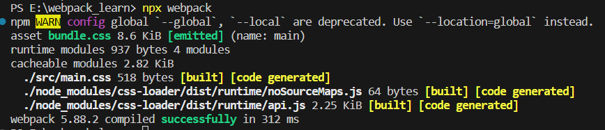

#### **webpack 学习**

1、当我们把打包的入口文件换成 main.css 之后，我们用 npx webpack 进行打包就会发现这里会有一个报错

```javascript
const path = require("path");

module.exports = {
  mode: "development", // 模式
  entry: "./src/main.css", // 打包入口文件
  output: {
    filename: "bundle.css", // 输出文件名
    path: path.join(__dirname, "dist"), // 输出文件路径
  },
};
```

这里的英文报错不难看出，这里说的是你需要一个 loader 来处理这种文件类型，这里是因为 webpack 默认只支持 JS 和 JSON 格式的文件，其他类型的文件都处理不了，所以这里我们就需要借助 loader 来进行不同类型文件的处理


Loader:

概念：那么什么是 loader 呢，来看到官方解释**loader**让 webpack 能够去处理其他类型的文件，并将它们转换为有效模块，以供应用程序使用，以及被添加到依赖图中。通俗易懂点来讲就是把 webpack 不认识的内容转换为它认识的内容。

所以这里我们安装 css-loader 来处理 css 文件

```css
npm install css-loader --save-dev
```

在 webpack 配置文件中配置资源加载的模块

```javascript
const path = require("path");

module.exports = {
  mode: "development", // 模式
  entry: "./src/main.css", // 打包入口文件
  output: {
    filename: "bundle.css", // 输出文件名
    path: path.join(__dirname, "dist"), // 输出文件路径
  },
  module: {
    rules: [
      //转换规则
      {
        test: /\.css$/, // 匹配所有css文件
        use: "css-loader", // use:对应的loader名称
      },
    ],
  },
};
```

再次执行 npx webpack 可以看到打包成功



Plugin：

概念：webpack 还有一个相当重要的概念，插件（plugin），官方的解释是**插件** 是 webpack 的 支柱 功能。Webpack 自身也是构建于你在 webpack 配置中用到的 **相同的插件系统** 之上！与用于转换特定类型文件的 loader 不同，plugin 可以贯穿整个 webpack 的生命周期，执行不同的任务。

例如我希望打包后的 css 或者 js 文件能够自动引入到 index.html 中，这时我们就要借助一个插件 html-webpack-plugin 来帮助我们完成这个操作

```shell
npm install html-webpack-plugin --save-dev
```

根目录新建一个 index.html 文件
